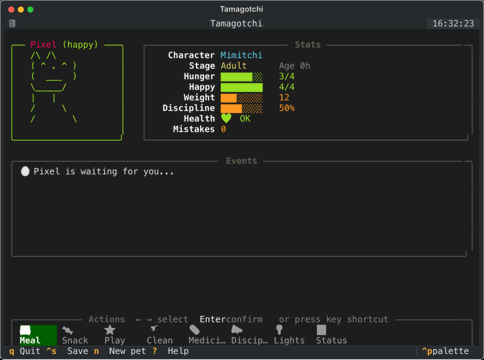

# 🥚 Tamagotchi — Terminal Virtual Pet

> Raise a virtual pet that lives in your terminal. A faithful recreation of the original Tamagotchi — hunger, happiness, sickness, poop, discipline, and care-driven evolution — built for developers who never leave the CLI.

[](https://pypi.org/project/tamagotchi)
[](https://www.npmjs.com/package/tamagotchi)




```
╔═══════════════════════════════════════════════╗
║                                               ║
║     .-----.        Hunger   ████████  4/4     ║
║    ( ^   ^ )       Happy    ████████  4/4     ║
║    (  ___  )       Weight   ████░░░░  12      ║
║     '-----'        Discpln  ██████░░  75%     ║
║     _| | |_        Health   ❤️  OK            ║
║                                               ║
║  🍱 Meal  🍬 Snack  ⭐ Play  🚿 Clean         ║
║  💊 Med   📣 Disc   💡 Light 📊 Status        ║
╚═══════════════════════════════════════════════╝
```

---

## Features

- **Full Tamagotchi mechanics** — Hunger, Happiness, Weight, Discipline, Health, Poop, Sickness, Lights/Sleep
- **6 life stages** — Egg → Baby → Child → Teen → Adult → Elder
- **Care-driven evolution** — 3 paths (Good / Normal / Poor) based on how well you care for your pet
- **Real-time aging** — pet lives on even when the game is closed
- **Animated ASCII sprites** — unique art per character and mood
- **AI agent plugins** — pet reacts to Claude Code, Aider, and Goose sessions in real time
- **`tama share`** — generate a shareable ASCII card, copy to clipboard, or embed in your GitHub README
- **Shell integrations** — tmux status bar, Starship prompt, `tama status --json`
- **Plugin system** — drop a `.py` in `~/.tamagotchi/plugins/` or register via entry points
- **Auto-save** — state persists to `~/.tamagotchi/`

---

## Roadmap

| Phase | Status | Description |
|-------|--------|-------------|
| **Phase 1** — Core Tamagotchi | ✅ In progress | Full pet mechanics, TUI, plugin system |
| **Phase 2** — AI Agent Awareness | 🔜 Planned | Claude Code, Aider, Goose, Cursor plugins |
| **Phase 3** — Peer Discovery | 🔜 Planned | Pets visit each other over LAN / Tailscale |
| **Phase 4** — Social Platform | 💭 Vision | Developer identity, team rooms, pet history |

---

## Install

```bash
# curl — one-liner, no Python or Node required
curl -fsSL https://raw.githubusercontent.com/usik/tamagotchi/main/install.sh | sh

# npx — works anywhere Node is available
npx tamagotchi

# pip
pip install tamagotchi

# uv (recommended for Python devs)
uv tool install tamagotchi

# Homebrew (tap)
brew tap usik/tamagotchi
brew install tamagotchi
```

Then run:

```bash
tama
```

---

## Controls

| Key | Action |
|-----|--------|
| `← →` | Navigate action menu |
| `Enter` | Confirm selected action |
| `M` | Feed meal (restores hunger) |
| `S` | Feed snack (boosts happiness) |
| `P` | Play (boosts happiness, lowers weight) |
| `C` | Clean poop |
| `D` | Give medicine |
| `I` | Discipline |
| `L` | Toggle lights (pet sleeps) |
| `T` | Show status |
| `Ctrl+S` | Save |
| `Q` | Save and quit |
| `?` | Help |

---

## Life Stages & Evolution

```
Egg (5min) → Baby (1h) → Child (8h) → Teen (1d) → Adult (3d) → Elder (2d) → Death
```

Evolution at each stage is driven by **care mistakes**:

| Path | Condition | Adult form | Elder form |
|------|-----------|------------|------------|
| Good | < 2 mistakes | Mimitchi | Ojitchi |
| Normal | 2–4 mistakes | Mametchi | Otokitchi |
| Poor | 5+ mistakes | Maskutchi | Tarakotchi |

**Care mistakes** happen when you:
- Overfeed (meal when hunger is already full)
- Give medicine when the pet isn't sick
- Ignore an attention call for too long

---

## tama share

Generate a shareable ASCII card of your pet — paste in Discord, Twitter/X, or embed in your GitHub README.

```bash
tama share              # print card to stdout
tama share --copy       # copy to clipboard
tama share --save       # save as <name>_card.txt
tama share --gist       # upload to GitHub Gist + get README embed snippet
tama share --name Pixel # share a specific pet by name
```

Example card:

```
┌─────────────────────────────────────┐
│    Pixel  •  Mimitchi  •  Adult     │
├─────────────────────────────────────┤
│     /\ /\        Hunger   ♥♥♥♡      │
│    ( ^ . ^ )     Happy    ♥♥♥♥      │
│    (  ___  )     Weight   10        │
│     \_____/      Age      2d        │
│      |   |       Mood   😊 Happy    │
│     /     \      Health   ❤️  OK    │
├─────────────────────────────────────┤
│  tamagotchi · github.com/usik/tamagotchi  │
└─────────────────────────────────────┘
```

The game prompts you to share automatically when your pet **evolves** or hits **peak form** (hunger + happy both at max).

**Embed in your GitHub profile README:**

```markdown

```

---

## Wire up AI coding agents

One command sets up hooks for all detected agents:

```bash
tama install
```

Auto-detects and configures: Claude Code, Aider, Goose, Starship, tmux.

Or install individually:

```bash
tama install --claude-code
tama install --aider
tama install --goose
tama install --starship
tama install --tmux
tama install --dry-run    # preview only
```

**Pet reactions per agent state:**

| Agent state | Pet reaction |
|-------------|-------------|
| Shipping code | Happy +1 |
| Stuck in a loop | Happy −1, Hungry −1 |
| Hitting repeated errors | Happy −1 |
| Tests pass | Happy +2 🎉 |
| Tests fail | Happy −1 |
| Task complete | Happy +2 |

---

## Shell integrations

**tmux status bar** — shows `😊 Pixel ♥♥♥♡` in your tmux bar:

```bash
# With TPM
set -g @plugin 'usik/tamagotchi'
# Or: tama install --tmux
```

**Starship prompt** — shows pet mood in your shell prompt:

```toml
# Add to ~/.config/starship.toml, or: tama install --starship
[custom.tamagotchi]
command = "tama status --json | python3 -c ..."
format = "[$output]($style) "
style = "bold cyan"
```

**JSON output** for custom integrations:

```bash
tama status --json
# {"name":"Pixel","mood":"happy","hunger":3,"happy":4,...}
```

---

## Plugin Development

Drop a `.py` file in `~/.tamagotchi/plugins/` — no install needed.

```python
# ~/.tamagotchi/plugins/my_plugin.py
from tamagotchi.plugins.base import BasePlugin

class MyPlugin(BasePlugin):
    name = "my_plugin"
    description = "Does something cool"

    def on_tick(self, pet):
        """Called every second."""
        pass

    def on_evolve(self, pet, old_stage, new_stage):
        """Called when pet evolves."""
        pass

    def on_agent_event(self, event_type, data):
        """React to AI coding agent events."""
        if event_type == "test_passed":
            pet.happy = min(4, pet.happy + 1)

    def on_peer_visit(self, visitor_pet):
        """Called when a peer's pet visits (Phase 3)."""
        pass
```

Or register via `pyproject.toml` entry points for distributable plugins:

```toml
[project.entry-points."tamagotchi.plugins"]
my_plugin = "my_package.plugin:MyPlugin"
```

---

## Development Setup

```bash
git clone https://github.com/usik/tamagotchi
cd tamagotchi
uv sync --dev
uv run pytest          # 52 tests
uv run tama            # run the game
```

---

## Contributing

Contributions are welcome — bug fixes, new ASCII sprites, plugins, or features from the roadmap. See [CONTRIBUTING.md](CONTRIBUTING.md) for full details.

**Good first contributions:**

| Area | Ideas |
|------|-------|
| 🎨 **Sprites** | New ASCII art, better idle animations |
| 🔌 **Plugins** | Cursor plugin, GitHub Copilot plugin, WakaTime integration |
| 🎮 **Mechanics** | Mini-games, hibernation mode, better discipline logic |
| 🌐 **Phase 3** | Peer discovery via mDNS or Tailscale |
| 🧪 **Tests** | Edge cases, async tick tests |
| 📖 **Docs** | Video demo, wiki, plugin examples |

**Project structure:**

```
tamagotchi/
├── src/tamagotchi/
│   ├── core/           # Pet engine — stats, evolution, persistence
│   ├── cli/            # share, install subcommands
│   ├── ui/             # Textual TUI — screens and widgets
│   ├── sprites/        # ASCII art for all characters and moods
│   └── plugins/        # Plugin loader and BasePlugin
├── plugins/
│   ├── claude_code/    # Claude Code integration
│   ├── aider/          # Aider integration
│   └── goose/          # Goose (Block) integration
├── integrations/
│   ├── tmux/           # TPM plugin
│   └── starship/       # Starship module
└── tests/              # pytest — 52 tests
```

---

## License

MIT — see [LICENSE](LICENSE).
